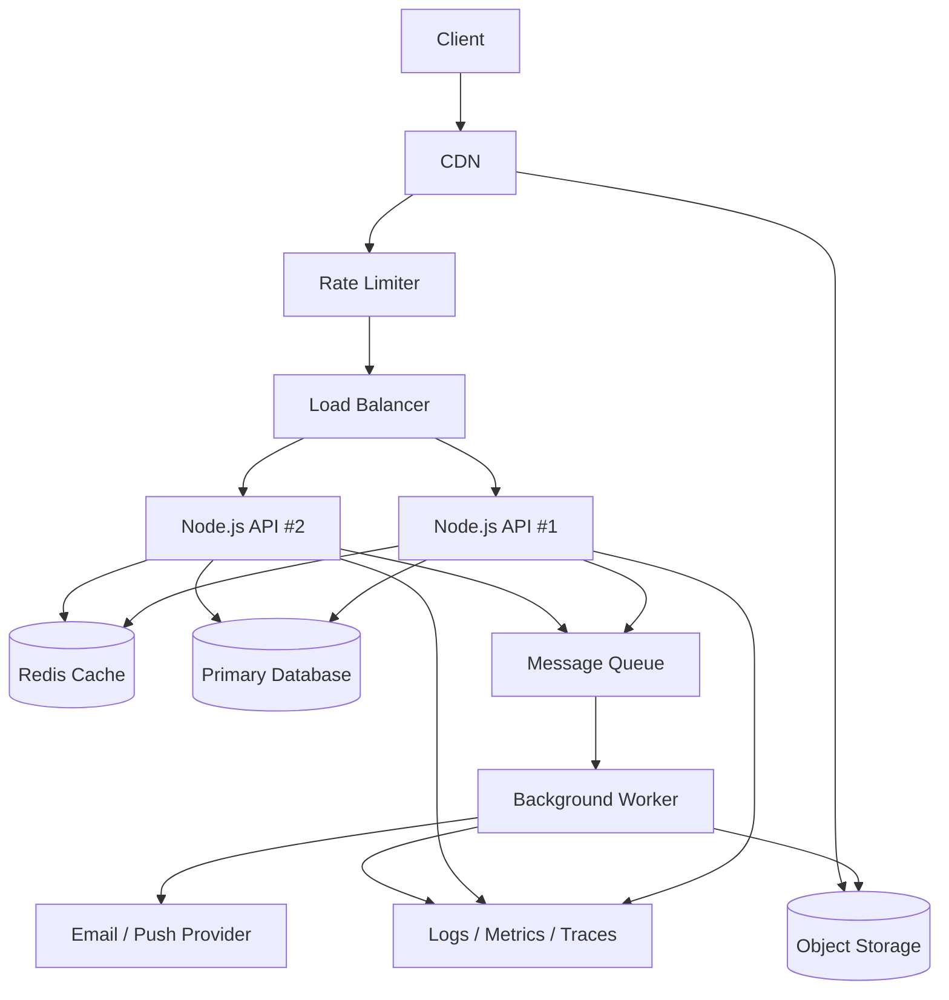

# Reference Architecture

The code in this repository intentionally stays small. The point is to map familiar Node.js code to production system-design concepts.

## How the demo maps to the diagram

| Diagram node | In this repo |
| --- | --- |
| CDN | Documented only (static assets are not served by the API) |
| Rate limiter | `src/middleware/rateLimit.js`, mounted on `/api` |
| Load balancer | Documented only (run multiple `npm start` instances) |
| Node.js API | `src/app.js`, `src/routes/*` |
| Redis cache | `src/routes/products.js` uses a local `Map` as a stand-in |
| Primary database | `src/services/productService.js` returns seed data |
| Message queue | `src/queue/jobQueue.js` (in-memory with retries) |
| Background worker | `src/workers/jobWorker.js` |
| Object storage | `src/services/objectStorage.js` returns a fake upload target |
| Logs / metrics / traces | `src/lib/logger.js` plus `src/middleware/observability.js` |

## What each layer solves

- **CDN**: serves cacheable static assets close to users, keeping them off the API.
- **Rate limiter**: caps how much work a single client can trigger in a window.
- **Load balancer**: spreads traffic across multiple stateless API instances.
- **Node.js API**: handles validation, business logic, and request/response flow (article §2, §4).
- **Redis**: would hold shared state and cache so instances agree (article §4, §5).
- **Primary database**: stores durable application state; scaling it means indexes, replicas, and sharding (article §6).
- **Message queue**: moves slow or retryable work out of the request path (article §7).
- **Worker**: performs CPU-heavy or background processing independently from the API (article §8).
- **Object storage**: stores large files such as videos, images, and PDFs, with metadata in the database (article §9).
- **Logs / metrics / traces**: make the system explainable when it is slow or broken (article §13).

## Reliability

The demo applies several ideas from article §12:

- health check at `/health`
- graceful shutdown that drains in-flight jobs before exit
- bounded retries on queue jobs
- a force-exit timer so shutdown cannot hang forever

## Scaling this demo toward production

The demo is deliberately in-process. The same architecture with real infrastructure looks like this:

- replace the `Map` cache with Redis
- replace the in-memory rate limiter with a Redis-backed one
- replace the in-memory queue with BullMQ, RabbitMQ, Kafka, or SQS
- replace the fake upload URL with a signed S3/R2/Wasabi URL
- emit logs as JSON to a collector and add metrics and tracing
